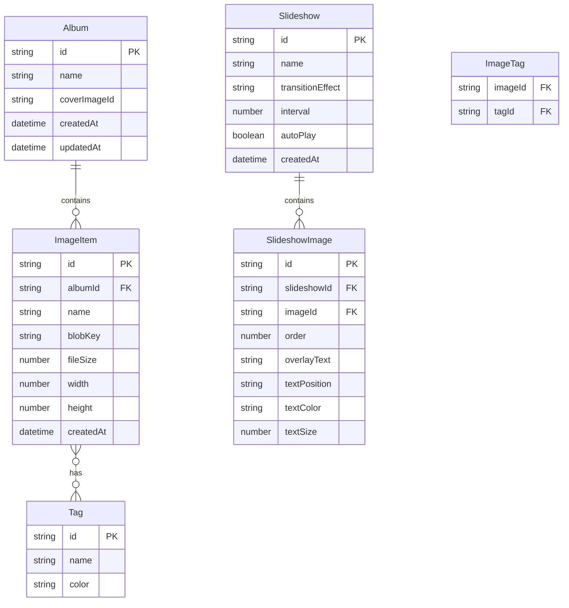

## 1. 架构设计

```mermaid
flowchart TD
    "A[React 前端]" --> "B[Zustand 状态管理]"
    "B" --> "C[Dexie.js / IndexedDB]"
    "A" --> "D[File API / Blob URL]"
    "D" --> "C"
```

纯前端架构，所有数据存储在浏览器 IndexedDB 中，无需后端服务。

## 2. 技术说明

- **前端**: React@18 + TypeScript + Tailwind CSS@3 + Vite
- **初始化工具**: vite-init (react-ts 模板)
- **后端**: 无（纯前端应用）
- **数据库**: IndexedDB（通过 Dexie.js 封装）
- **状态管理**: Zustand
- **路由**: React Router DOM
- **图标**: Lucide React

## 3. 路由定义

| 路由 | 用途 |
|------|------|
| `/` | 相册主页，展示相册列表和快速上传 |
| `/album/:id` | 相册详情页，展示相册内图片 |
| `/preview/:id` | 图片预览页，全屏查看单张图片 |
| `/slideshow/edit` | 轮播编辑页，配置轮播参数 |
| `/slideshow/play` | 轮播播放页，全屏播放轮播 |

## 4. API 定义

无后端 API，所有数据操作通过 Dexie.js 直接读写 IndexedDB。

### 数据操作接口（Dexie.js 封装）

```typescript
// 相册操作
interface AlbumService {
  createAlbum(name: string): Promise<Album>
  renameAlbum(id: string, name: string): Promise<void>
  deleteAlbum(id: string): Promise<void>
  getAllAlbums(): Promise<Album[]>
  getAlbumById(id: string): Promise<Album | undefined>
}

// 图片操作
interface ImageService {
  addImage(file: File, albumId: string): Promise<ImageItem>
  deleteImage(id: string): Promise<void>
  moveImage(id: string, targetAlbumId: string): Promise<void>
  getImagesByAlbum(albumId: string): Promise<ImageItem[]>
  getImagesByTags(tags: string[]): Promise<ImageItem[]>
}

// 标签操作
interface TagService {
  createTag(name: string): Promise<Tag>
  deleteTag(id: string): Promise<void>
  getAllTags(): Promise<Tag[]>
  addTagToImage(imageId: string, tagId: string): Promise<void>
  removeTagFromImage(imageId: string, tagId: string): Promise<void>
}

// 轮播操作
interface SlideshowService {
  createSlideshow(config: SlideshowConfig): Promise<Slideshow>
  updateSlideshow(id: string, config: Partial<SlideshowConfig>): Promise<void>
  deleteSlideshow(id: string): Promise<void>
  getAllSlideshows(): Promise<Slideshow[]>
}
```

## 5. 服务器架构图

不适用（纯前端应用）

## 6. 数据模型

### 6.1 数据模型定义



### 6.2 数据定义语言

```sql
-- Dexie.js schema (IndexedDB)

-- albums 表
++id, name, coverImageId, createdAt, updatedAt

-- images 表
++id, albumId, name, blobKey, fileSize, width, height, createdAt
[albumId+createdAt]

-- tags 表
++id, &name, color

-- imageTags 表
[imageId+tagId], imageId, tagId

-- slideshows 表
++id, name, transitionEffect, interval, autoPlay, createdAt

-- slideshowImages 表
++id, slideshowId, imageId, order, overlayText, textPosition, textColor, textSize
[slideshowId+order]

-- blobs 表（存储图片二进制数据）
++id, data
```
